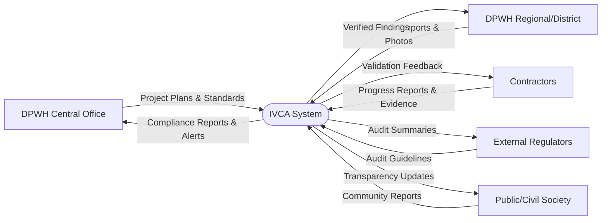

# IVCA System Data Flow Diagram (DFD-0)
**Context-Level Data Flow Diagram**

---

## Overview

This Data Flow Diagram (DFD-0) illustrates the high-level information flows between the AI-Powered Independent Verification & Compliance Auditor (IVCA) system and its external entities. It shows how data moves into and out of the IVCA platform from various stakeholders in the DPWH infrastructure ecosystem.

---

## Context Diagram

---

## External Entities

### 1. DPWH Central Office
**Role:** Policy-setting, standards definition, and overall project oversight

**Data Provided to IVCA:**
- Project plans and specifications
- Budget allocations and ABCs
- Procurement standards and guidelines
- Quality control requirements

**Data Received from IVCA:**
- Compliance reports and analytics
- Anomaly detection alerts
- Risk assessments
- Performance dashboards

---

### 2. DPWH Regional / District Offices
**Role:** Field implementation, inspection, and local project management

**Data Provided to IVCA:**
- Inspection reports and findings
- Site photographs and documentation
- Material test results
- Progress monitoring data

**Data Received from IVCA:**
- Verified inspection findings
- Corrective action recommendations
- Quality compliance alerts
- Performance metrics

---

### 3. Contractors / Implementers
**Role:** Project execution and delivery

**Data Provided to IVCA:**
- As-built documentation
- Accomplishment reports
- Geotagged progress evidence
- Material certificates and test results
- Milestone completion claims

**Data Received from IVCA:**
- Validation feedback and verification status
- Discrepancy notices
- Compliance requirements
- Documentation deficiency alerts

---

### 4. External Regulators (COA, NEDA, DBM)
**Role:** Independent oversight, audit, and fiscal control

**Data Provided to IVCA:**
- Audit guidelines and requirements
- Funding conditions and restrictions
- Compliance frameworks
- Reporting standards

**Data Received from IVCA:**
- AI-generated audit summaries
- Exceptions and findings list
- Compliance verification reports
- Risk and anomaly alerts
- Immutable audit trails

---

### 5. Public / Civil Society
**Role:** Community monitoring and transparency stakeholders

**Data Provided to IVCA (Optional):**
- Community reports and observations
- Complaints or concerns
- Citizen-submitted photographs
- Public feedback

**Data Received from IVCA:**
- Transparency updates and public dashboards
- Verified project status
- Completion milestones
- Quality assurance information

---

## Data Flow Characteristics

### Inputs to IVCA (P0)

| Data Type | Source | Format | Frequency |
|-----------|--------|--------|-----------|
| Project Plans | DPWH Central | PDF, XML, Structured Data | Per Project |
| Inspection Reports | Regional/District Offices | PDF, Forms, Photos | Weekly/Monthly |
| Accomplishment Reports | Contractors | PDF, Photos, GPS Data | Monthly |
| Audit Guidelines | COA/NEDA | PDF, Standards Docs | Quarterly |
| Community Reports | Public | Text, Photos, Forms | Ad-hoc |

### Outputs from IVCA (P0)

| Data Type | Destination | Format | Frequency |
|-----------|------------|--------|-----------|
| Compliance Reports | DPWH Central | Dashboard, PDF, Excel | Real-time/Monthly |
| Verified Findings | Regional/District | Reports, Alerts | Real-time |
| Validation Feedback | Contractors | Notifications, Reports | Per Submission |
| Audit Summaries | COA/NEDA/DBM | Structured Reports | Monthly/Quarterly |
| Transparency Updates | Public | Web Dashboard | Real-time |

---

## Key Features of IVCA Data Processing

### 1. AI-Powered Analysis
- Natural Language Processing (NLP) for document review
- Computer Vision for image and video verification
- Machine Learning for anomaly detection
- Predictive analytics for risk assessment

### 2. Real-Time Verification
- Instant validation of submitted documents
- Automated compliance checking
- Live monitoring dashboards
- Immediate alert generation

### 3. Multi-Source Integration
- Combines data from multiple stakeholders
- Cross-references information for accuracy
- Identifies inconsistencies across sources
- Provides holistic project view

### 4. Audit Trail Integrity
- Immutable logging of all transactions
- Tamper-evident data storage
- Complete traceability
- COA-compliant audit trails

---

## Data Privacy and Security

### Protection Measures

**Encryption:**
- All data encrypted in transit (TLS 1.3)
- At-rest encryption (AES-256)
- Zero-trust architecture

**Access Control:**
- Role-based access control (RBAC)
- Multi-factor authentication
- Audit logging of all access

**Compliance:**
- RA 10173 (Data Privacy Act)
- DICT Cybersecurity Standards
- COA Data Retention Requirements

---

## System Boundaries

### What IVCA Does:
✅ Processes and analyzes verification data  
✅ Generates compliance reports and alerts  
✅ Provides verification feedback  
✅ Creates audit trails and summaries  

### What IVCA Does NOT Do:
❌ Make contract award decisions  
❌ Approve or reject payments  
❌ Enforce contractual obligations  
❌ Become party to construction contracts  

**Note:** All decision-making authority remains with DPWH, COA, and relevant government agencies. IVCA provides verification data only.

---

## Benefits of the Data Flow Architecture

### For DPWH
- Centralized verification data
- Real-time visibility across all projects
- Reduced manual processing time
- Enhanced decision support

### For Contractors
- Clear verification requirements
- Faster feedback on submissions
- Reduced back-and-forth communications
- Transparent compliance status

### For Regulators (COA/NEDA)
- Standardized audit data
- Complete digital trails
- Automated exception reporting
- Risk-based oversight capability

### For the Public
- Enhanced transparency
- Access to verified information
- Community engagement channel
- Accountability mechanism

---

## Technical Implementation Notes

### Data Ingestion Methods
1. **API Integration** - Real-time data exchange with DPWH systems
2. **Web Portal** - User interface for manual uploads
3. **Mobile App** - Field data collection and geotagged submissions
4. **Batch Processing** - Scheduled imports of large datasets

### Data Storage
- Cloud/hybrid architecture for scalability
- Redundant storage for high availability
- Backup and disaster recovery systems
- Compliance with government data sovereignty requirements

### Data Retention
- Active project data: Real-time access
- Completed projects: 10-year retention
- Audit trails: Permanent archive
- Personal data: Per RA 10173 requirements

---

## Future Enhancements

### Phase 2 Considerations
- Integration with PhilGEPS procurement system
- Direct feed from DPWH Project Management Information System (PMIS)
- IoT sensor integration for real-time construction monitoring
- Blockchain implementation for immutable audit logs
- Public API for third-party transparency tools

---

## Conclusion

This DFD-0 demonstrates how IVCA serves as a central verification hub, receiving data from multiple stakeholders, processing it through AI-powered analytics, and providing verified outputs to support better decision-making across the DPWH infrastructure ecosystem.

The system enhances transparency, reduces manual effort, improves accuracy, and provides objective, data-driven insights while maintaining clear boundaries that all contractual obligations remain between DPWH and contractors.

---

**Document Version:** 1.0  
**Date:** 2025-11-20  
**Classification:** Public
