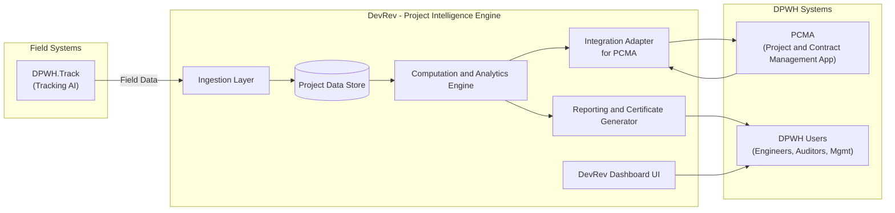
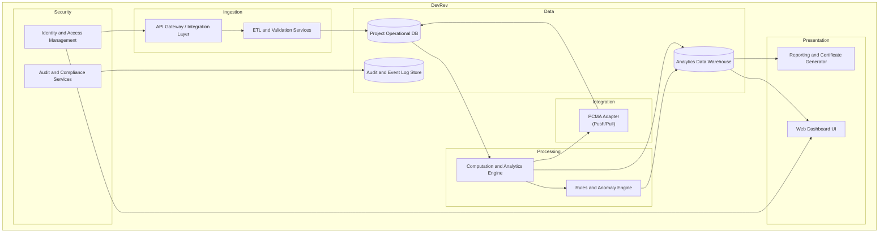

# DevRev Technical Architecture
Version 1.0  
Date: 2025-11-25

## 1. Introduction

### 1.1 Purpose

This document describes the **technical architecture** of the **DevRev** (Development Review) system for the Department of Public Works and Highways (DPWH). DevRev is the **Project Intelligence Engine** that consolidates construction project data from the DPWH.Track (Tracking AI) capstone system and the existing DPWH Project and Contract Management Application (PCMA), analyzes project performance, and generates authoritative, audit-friendly outputs such as variance reports and milestone completion certificates.

### 1.2 Scope

This architecture covers:

- Core DevRev components and their responsibilities  
- Data flows between DevRev, DPWH.Track, and PCMA  
- Storage and data model concepts  
- Integration patterns and APIs  
- Security, audit, and non-functional considerations  
- Deployment and operational view (environments and topology)

DevRev does **not** replace PCMA or DPWH.Track. Instead, it acts as an **intelligence and integration layer** sitting between field data and official project records.

### 1.3 Target Users

- DPWH Central Office (Planning, Monitoring, IT)  
- DPWH Regional and District Engineering Offices  
- Project Engineers and Resident Engineers  
- Internal and External Auditors  
- Contractors (read-only / limited views for validation)

---

## 2. High-Level Concept

### 2.1 System Overview

At a high level, DevRev:

1. **Ingests and normalizes data** from DPWH.Track (field collection system).  
2. **Pulls contract baselines and milestones** from PCMA.  
3. **Computes project performance** (percentage completion, delays, variance).  
4. **Flags anomalies and risks** based on rule sets and computed metrics.  
5. **Publishes back** validated status and milestone completion to PCMA.  
6. **Generates documents** such as milestone completion certificates with DPWH seals and QR-based verification.

### 2.2 Context Diagram (High-Level)

---

## 3. Architectural Principles

1. **Separation of Concerns** – Data capture (DPWH.Track), project intelligence (DevRev), and contract system of record (PCMA) are distinct but tightly integrated.  
2. **Source-of-Truth Clarity** – PCMA remains the official contract and baseline source. DevRev is the source of **computed performance** and variance.  
3. **API-First Integration** – All interactions with DPWH.Track and PCMA occur via well-defined APIs or data exchange interfaces.  
4. **Auditability** – Every computation and update must be traceable, with persistent logs and verifiable documents.  
5. **Extensibility** – DevRev must support additional data sources (e.g., sensors, drones, third-party ERPs) in future phases.  
6. **Security by Design** – Principle of least privilege, encryption in transit and at rest, robust authentication and authorization.

---

## 4. Logical Architecture

### 4.1 Component View

### 4.2 Major Components

1. **API Gateway / Integration Layer**  
   - Unified entry point for DPWH.Track, PCMA, and other integration clients.  
   - Responsible for rate limiting, authentication, and routing.

2. **ETL & Validation Services**  
   - Receive field data payloads (JSON, CSV, files) from DPWH.Track.  
   - Normalize, validate, and enrich (e.g., resolving project IDs, stationing, BOQ items).  

3. **Project Operational Database (PDB)**  
   - Stores normalized operational data: attendance, materials, equipment logs, work reports, project metadata.  
   - Optimized for transactional queries and short-term history.

4. **Analytics Data Warehouse (DW)**  
   - Dimensional model for reporting and analytics.  
   - Stores computed aggregates, historical snapshots, and variance metrics.

5. **Computation & Analytics Engine**  
   - Implements percentage completion calculations, earned value management (EVM), and run-rate projections.  
   - Reconciles field data with PCMA contract milestones.

6. **Rules & Anomaly Engine**  
   - Encodes business rules, e.g.:  
     - No time-out = no credited work hours  
     - Withdrawal without receiving = anomaly  
     - Missing daily work report = risk flag  
     - Equipment missing photos today = risk flag  

7. **PCMA Adapter**  
   - Handles all interaction with the PCMA system.  
   - May support:  
     - Pull contract baselines and schedules  
     - Push validated milestone completions  
     - Sync project status and completion percentages  

8. **Dashboard UI**  
   - Web-based interface for monitoring projects, variances, and certificates.  
   - Provides RAG (Red-Amber-Green) status indicators and drill-downs.

9. **Reporting & Certificate Generator**  
   - Generates PDF and/or digitally signed documents:  
     - Milestone Completion Certificates  
     - Project Variance Reports  
   - Adds watermark, DPWH seal, QR code for authenticity, and reference hashes.

10. **Identity & Access Management (IAM)**  
    - Centralized user management and RBAC (Role-Based Access Control).  
    - Integrates with DPWH SSO / directory if available.

11. **Audit & Compliance Services**  
    - Centralized logging and immutable event registry.  
    - Stores evidence of computations, certificate generation, and external system updates.

---

## 5. Data Architecture

### 5.1 Core Entities (Conceptual)

- **Project** – project-level metadata, location, contract amount, start/end dates, implementing office.  
- **Contract / BOQ (Bill of Quantities)** – contract line items, unit quantities, unit prices, item codes.  
- **Milestone** – defined stages tied to BOQ items and/or schedule.  
- **Activity Log** – high-level daily/weekly project activity record.  
- **Attendance Record** – worker-level or crew-level time logs (time-in, time-out, role, location).  
- **Material Receipt** – material deliveries (quantities, item codes, DR, photos, receiving officer signature).  
- **Material Withdrawal** – withdrawal reports (quantities, referencing receipts, authorizing officer signature).  
- **Equipment Log** – daily records of equipment on-site, serial numbers, photos, hours used.  
- **Work Performance Report** – daily progress with photos, quantities accomplished, narrative.  
- **Variance Record** – computed schedule variance, cost variance, and risk flags.  
- **Certificate** – generated documents, including hash, QR, and status (draft/issued/revoked).  
- **User / Role / Permission** – identity and authorization model.  
- **ExternalSystemLink** – mapping between DevRev IDs and PCMA IDs / DPWH.Track IDs.

### 5.2 Logical Data Stores

1. **Operational DB (OLTP)**  
   - Normalized schema (3NF)  
   - Handles ingestion, updates, and short-term queries.

2. **Analytics Warehouse (OLAP)**  
   - Star or snowflake schema (facts and dimensions):  
     - Facts: attendance, materials, equipment usage, daily outputs, milestones, variances.  
     - Dimensions: project, time, location, contractor, equipment, material, BOQ item.

3. **Document Store / Object Storage**  
   - Stores PDFs, images, and raw uploads from DPWH.Track (receipts, photos, signatures).  
   - Only references (URIs) are stored in the DB.

4. **Log & Event Store**  
   - Append-only event data for audit, debugging, and analytics on system behavior.

### 5.3 Data Flow Summary

1. DPWH.Track uploads daily data → DevRev Ingestion → Operational DB.  
2. Nightly or near-real-time jobs → transform operational data into warehouse facts/dimensions.  
3. Computation Engine reads from warehouse + contract baselines → writes metrics back to warehouse and operational DB.  
4. PCMA adapter reads validated metrics → updates PCMA.  
5. Reporting engine reads from warehouse / operational DB → generates documents.

---

## 6. Integration Architecture

### 6.1 DPWH.Track Integration

- **Mode:** REST APIs, message queues, or scheduled file drops (JSON/CSV).  
- **Direction:** Primarily **inbound** (DevRev receives data).  
- **Key Endpoints:**  
  - `/api/attendance` – daily attendance payloads  
  - `/api/materials/receipts` – materials received data  
  - `/api/materials/withdrawals` – withdrawals data  
  - `/api/equipment/logs` – equipment usage logs  
  - `/api/work-reports` – daily work performance

- **Security:**  
  - API key or OAuth2 for DPWH.Track → DevRev.  
  - IP whitelisting and TLS for transport security.

### 6.2 PCMA Integration

- **Mode:** REST APIs, SOAP, database link, or file-based integration (depending on existing PCMA capabilities).  
- **Direction:** **Bidirectional:**  
  - Pull contract info and baselines from PCMA → DevRev.  
  - Push milestone completion and performance metrics DevRev → PCMA.

- **Key Functions:**  
  - Sync Project Master Data.  
  - Sync Contract/BOQ and Milestones.  
  - Update Milestone Completion Status and Percentages.

- **Resilience Features:**  
  - Retry queues for failed calls.  
  - Dead-letter queues for persistent failures.  
  - Idempotent update design (no double-posting).

### 6.3 External Services (Optional / Future)

- GIS systems for spatial analysis.  
- IoT/sensor feeds (e.g., equipment telematics).  
- Document signing platforms for enhanced legal validity.

---

## 7. Security Architecture

### 7.1 Authentication & Authorization

- Integration with DPWH identity provider (if available) or standalone IAM.  
- Multi-role structure (Admin, Central Office Analyst, Regional Engineer, Auditor, Contractor View).  
- Principle of Least Privilege (PoLP) for system-to-system and user access.

### 7.2 Data Protection

- TLS (HTTPS) required for all network traffic.  
- Encryption at rest for databases and object storage.  
- Regular backup and disaster recovery procedures.

### 7.3 Audit & Compliance

- Every external call (to/from PCMA, DPWH.Track) logged.  
- Every significant user action recorded (e.g., certificate generation, milestone override).  
- Hashes of critical outputs (e.g., certificates) stored for later verification.  
- Optional blockchain-style anchoring in future phases.

---

## 8. Non-Functional Requirements (NFRs)

### 8.1 Performance

- Capable of handling **hundreds of projects** with daily data uploads.  
- Batch computations (e.g., nightly runs) should complete within defined windows (e.g., 1–2 hours).  
- Synchronous APIs should respond within < 2 seconds for typical requests.

### 8.2 Scalability

- Horizontal scalability for the API and computation services.  
- Storage designed to accommodate multi-year project histories.

### 8.3 Availability & Reliability

- Target availability of 99.5% or higher for production.  
- Graceful degradation: if PCMA is down, DevRev queues updates for later transmission.

### 8.4 Maintainability

- Modular codebase with clear bounded contexts (Ingestion, Processing, Integration, Reporting).  
- Config-driven rules and thresholds where possible (no hard-coded business logic).

### 8.5 Observability

- Centralized logging with correlation IDs.  
- Metrics for processing times, error rates, and API performance.  
- Dashboards and alerts for failures and anomalies.

---

## 9. Reference Technology Stack (Illustrative)

> Note: The actual stack can be adapted to DPWH standards. Below is a reference design.

- **Backend Framework:** Laravel / Node.js / Java Spring (depending on DPWH preference).  
- **Frontend:** Vue.js / React-based dashboard.  
- **Database (OLTP):** PostgreSQL / MySQL.  
- **Data Warehouse:** PostgreSQL (star schema), or dedicated DW if available.  
- **Message Queue:** RabbitMQ / Kafka / AWS SQS / Azure Service Bus.  
- **Object Storage:** S3-compatible or on-premise equivalent.  
- **Authentication:** Keycloak / OAuth2 / SAML SSO.  
- **PDF Generation:** Headless Chrome / wkhtmltopdf / TCPDF-based service.  
- **QR/Hashing:** QR library (e.g., qrcode), SHA-256 hashing for certificate verification.

---

## 10. Deployment Architecture

### 10.1 Environments

- **Development** – for ongoing development and unit testing.  
- **Staging / UAT** – integrated environment with test links to DPWH.Track and PCMA.  
- **Production** – hardened environment with strict change control.

### 10.2 Topology (Illustrative)

- Load balancer → API/API Gateway nodes  
- Application nodes (Ingestion, Processing, Reporting)  
- Database cluster (Primary + Replica)  
- Data warehouse node(s)  
- Logging/monitoring stack (e.g., ELK/EFK)  
- Bastion host for admin access

---

## 11. Operational Considerations

### 11.1 Batch & Scheduling

- Nightly jobs for heavy computations and reporting.  
- Near-real-time ingestion for critical updates (attendance, materials).

### 11.2 Backup & Recovery

- Automated database backups with defined RPO/RTO.  
- Offsite backup storage policies.

### 11.3 Configuration Management

- Centralized configuration for thresholds (slippage definitions, risk categories, etc.).  
- Feature flags for enabling/disabling modules.

---

## 12. Future Extensions

- Integration with drone-based progress estimation and photo analytics.  
- ML-based delay prediction based on historical project performance.  
- Public-facing transparency portal (read-only view of project status for citizens).  
- Full archival and analytics of completed projects for policy and planning.

---

## 13. Summary

DevRev is the **intelligence and integration backbone** between real-world project execution (DPWH.Track) and contractual reality (PCMA). This technical architecture ensures that:

- Data from the field is **captured, validated, and transformed** into reliable project intelligence.  
- Computed metrics and variance analyses are **fed back** into DPWH’s official systems.  
- Audit-ready reports and certificates are **generated automatically**, improving transparency and accountability.

This document serves as the foundation for the subsequent **SRS, development plan, and DPWH pitch materials**.
