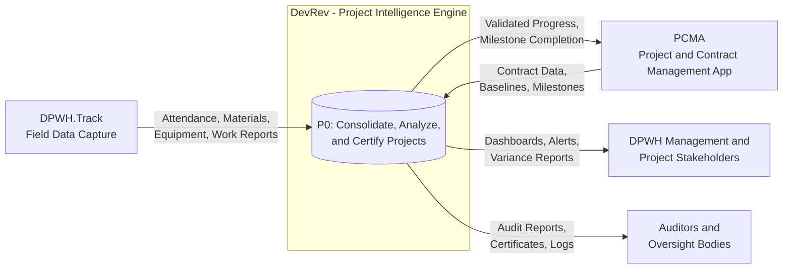
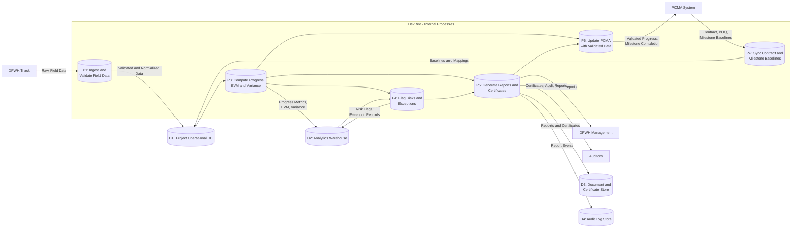
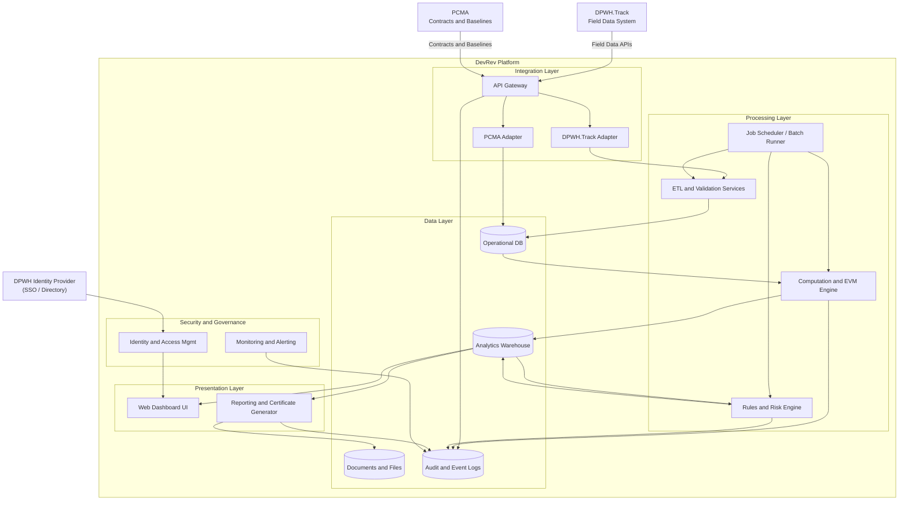
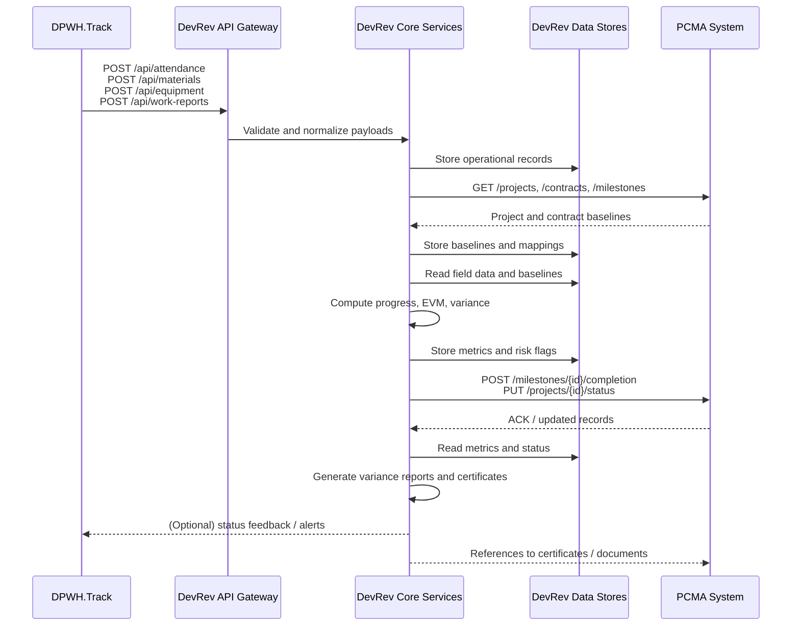

# DevRev Technical Diagrams
Version 1.0  
Date: 2025-11-25

This document contains the key Mermaid diagrams for DevRev:

- **DFD-0** – Context-level data flow  
- **DFD-1** – Decomposition of the main DevRev process  
- **Logical Architecture Diagram** – Component view  
- **Integration Diagram** – Interfaces among DevRev, DPWH.Track, and PCMA  

You can paste these Mermaid blocks into any Mermaid-compatible renderer (e.g., Mermaid Live Editor, MkDocs with Mermaid plugin, Obsidian, VS Code extensions).

---

## 1. DFD-0 – Context Diagram

---

## 2. DFD-1 – Decomposition of P0 (DevRev Core Process)

This diagram decomposes **P0: Consolidate, Analyze, and Certify Projects** into sub-processes.

---

## 3. Logical Architecture Diagram (Components)

---

## 4. Integration Diagram (DevRev, DPWH.Track, PCMA)

---

