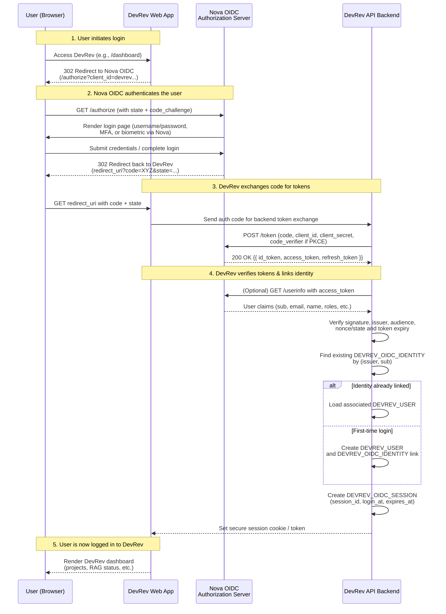

# DevRev ⇄ Nova OIDC Integration – ERD & Process Flow
Version 1.0  
Date: 2025-11-25

This document describes the **entity relationship model** and the **authentication/authorization process flow** between **DevRev** and **Nova OIDC** (OpenID Connect Identity Provider).

---

## 1. Conceptual Overview

- **Nova OIDC** acts as the **central Identity Provider (IdP)** for Project Nova and DevRev.  
- **DevRev** is an OIDC **Relying Party (RP) / Client** that:
  - Redirects users to Nova for login  
  - Receives ID/access tokens  
  - Maps Nova identities to internal DevRev users, roles, and permissions  

DevRev **does not own passwords**. It trusts Nova’s OIDC tokens and only stores the minimum linkage data required to bind a Nova identity to DevRev’s authorization model.

---

## 2. Entity Relationship Diagram (ERD)

Below is a high-level ERD in Mermaid, focusing on the entities relevant to the DevRev–Nova OIDC integration.

```mermaid
erDiagram
    DEVREV_USER {
        uuid id
        string email
        string full_name
        boolean is_active
        datetime created_at
        datetime updated_at
    }

    DEVREV_ROLE {
        uuid id
        string name
        string description
        datetime created_at
        datetime updated_at
    }

    DEVREV_USER_ROLE {
        uuid id
        uuid user_id
        uuid role_id
        datetime created_at
    }

    DEVREV_PROJECT {
        uuid id
        string code
        string name
        string region
        string status
        datetime created_at
        datetime updated_at
    }

    DEVREV_PROJECT_MEMBERSHIP {
        uuid id
        uuid project_id
        uuid user_id
        string membership_role
        datetime created_at
    }

    DEVREV_OIDC_IDENTITY {
        uuid id
        uuid user_id
        string provider_name      // e.g. "nova-oidc"
        string subject            // sub from Nova
        string issuer             // iss from Nova
        string email_claim        // email from Nova
        string raw_claims_json    // optional
        datetime linked_at
        datetime last_login_at
    }

    DEVREV_OIDC_SESSION {
        uuid id
        uuid user_id
        string session_id         // DevRev session identifier
        string id_token_jti       // ID token unique id (if present)
        string access_token_hash  // hash of access token (optional)
        datetime login_at
        datetime expires_at
        boolean is_active
    }

    NOVA_OIDC_CLIENT {
        string client_id
        string client_name
        string redirect_uri
        string scopes
    }

    NOVA_OIDC_ISSUER {
        string issuer             // https://auth.nova.example.com/
        string jwks_uri
        string authorization_endpoint
        string token_endpoint
        string userinfo_endpoint
    }

    %% Relationships
    DEVREV_USER ||--o{ DEVREV_USER_ROLE : "has many"
    DEVREV_ROLE ||--o{ DEVREV_USER_ROLE : "assigned to many users"

    DEVREV_USER ||--o{ DEVREV_PROJECT_MEMBERSHIP : "assigned to"
    DEVREV_PROJECT ||--o{ DEVREV_PROJECT_MEMBERSHIP : "has members"

    DEVREV_USER ||--o{ DEVREV_OIDC_IDENTITY : "linked via"
    DEVREV_OIDC_IDENTITY }o--|| NOVA_OIDC_ISSUER : "issued by"

    DEVREV_USER ||--o{ DEVREV_OIDC_SESSION : "opens"
    NOVA_OIDC_CLIENT }o--o{ DEVREV_OIDC_SESSION : "used during auth"
```

### 2.1 Entity Notes

- **DEVREV_USER**  
  Internal DevRev user entity. Linked to one or more OIDC identities via `DEVREV_OIDC_IDENTITY`.

- **DEVREV_ROLE / DEVREV_USER_ROLE**  
  Standard role-based access control (RBAC) tables controlling what a user can do inside DevRev (e.g., “Central Analyst”, “Regional Engineer”, “Auditor”).

- **DEVREV_PROJECT / DEVREV_PROJECT_MEMBERSHIP**  
  Projects monitored by DevRev, and which users (from Nova/DevRev) are allowed to view or manage them.

- **DEVREV_OIDC_IDENTITY**  
  Link table between DevRev users and Nova OIDC identities. Stores `sub`, `iss`, email claim, etc. One DevRev user can have multiple OIDC identity links if needed (e.g., different realms or providers).

- **DEVREV_OIDC_SESSION**  
  Server-side record for each authenticated session in DevRev, correlated with OIDC tokens (ID/access token metadata) but not storing raw tokens in plaintext.

- **NOVA_OIDC_CLIENT**  
  Represents DevRev’s registration as an OIDC client (client_id, redirect_uri, allowed scopes).

- **NOVA_OIDC_ISSUER**  
  Metadata describing the Nova OIDC issuer (endpoints, jwks_uri). Typically derived from `.well-known/openid-configuration`.

---

## 3. Process Flow – DevRev Login via Nova OIDC

The following Mermaid sequence diagram shows the **authentication process** from DevRev to Nova OIDC using the standard Authorization Code (with PKCE if desired) flow.



---

## 4. Process Flow – DevRev API Call with Nova-Backed Session

Once authenticated, DevRev uses its own session management. Optionally, DevRev can still leverage Nova’s tokens for downstream access or session validation.

```mermaid
sequenceDiagram
    participant U as User (Browser)
    participant DV as DevRev Web App
    participant API as DevRev API Backend
    participant AS as Nova OIDC

    Note over U,DV,API: Logged-in user calls a protected API

    U->>DV: Clicks "View Project Details"
    DV->>API: GET /api/projects/{id}<br/>(with DevRev session cookie)

    API->>API: Validate session (DEVREV_OIDC_SESSION)
    alt Session valid
        API->>API: Load DEVREV_USER + roles + memberships
        API-->>DV: 200 OK {{ project details }}
        DV-->>U: Render project page
    else Session invalid / expired
        API-->>DV: 401 Unauthorized
        DV-->>U: Redirect to Nova OIDC login
    end

    opt Optional OIDC Introspection or Re-check
        API->>AS: (Optional) POST /introspect or /userinfo<br/>with access_token
        AS-->>API: Token status / user claims
        API->>API: Optionally update last_login_at,<br/>sync claims, or revoke session
    end
```

---

## 5. Integration Notes – DevRev to Nova OIDC

1. **Client Registration**  
   - DevRev is registered in Nova as an OIDC Client (`NOVA_OIDC_CLIENT` conceptually).  
   - Nova provides: `client_id`, `client_secret`, redirect URIs, allowed scopes.

2. **Claims Mapping**  
   - `sub` → stored in `DEVREV_OIDC_IDENTITY.subject`  
   - `iss` → stored in `DEVREV_OIDC_IDENTITY.issuer`  
   - `email` → used to pre-fill `DEVREV_USER.email` (and keep in sync if desired)  
   - `name` → used to populate `DEVREV_USER.full_name`  

3. **Roles & Authorization**  
   - Nova may issue role/realm claims, but DevRev maintains its own **internal RBAC**: `DEVREV_ROLE` and `DEVREV_USER_ROLE`.  
   - Optionally, Nova roles can be mapped to DevRev roles at login.

4. **Sessions & Logout**  
   - DevRev manages its own web session (`DEVREV_OIDC_SESSION`).  
   - Nova OIDC supports:  
     - RP-initiated logout (DevRev calls Nova logout endpoint)  
     - Back-channel or front-channel logout to notify DevRev of global logout (optional enhancement).

---

## 6. How to Use This File

- For **MkDocs**:  
  - Save as `devrev-nova-oidc-erd-and-flow.md` and enable Mermaid support.
- For **Diagram Export**:  
  - Copy each Mermaid block into a Mermaid Live Editor to render and export as PNG/SVG.
- For **Architecture Docs / PPTX**:  
  - Export diagrams as images and embed them into your DevRev + Nova technical decks.

---

This ERD and flow provide a clear **bridge** between DevRev’s internal data model and Nova’s OIDC-based identity, making it easy to implement a clean, secure, and extensible authentication integration.
